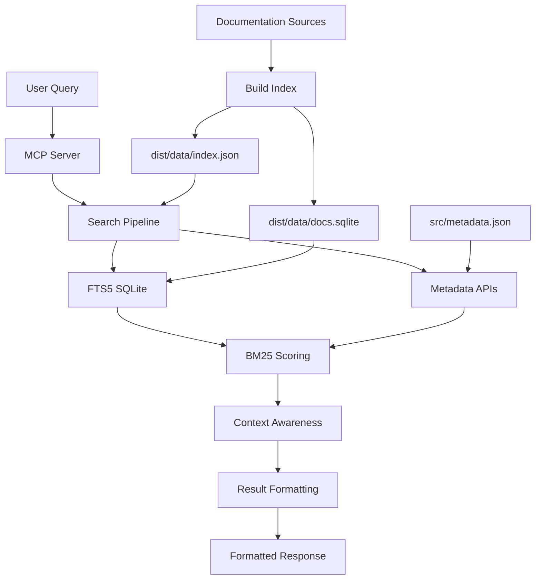

# 🏗️ SAP Docs MCP Architecture

## System Overview



## Core Components

### 🔍 **Search Pipeline**
1. **Query Processing**: Parse and expand user queries with synonyms/acronyms
2. **FTS5 Search**: Fast SQLite full-text search using BM25 algorithm
3. **Metadata Integration**: Apply source boosts, context awareness, and mappings
4. **Result Formatting**: Structure results with scores, context indicators, and source attribution

### 📊 **Data Flow**
```
Documentation Sources → Build Scripts → Search Artifacts → Runtime Search
     (12 sources)      →   (2 files)   →   (index.json +   →  (BM25 + 
                                            docs.sqlite)        metadata)
```

### 🎯 **Metadata-Driven Configuration**
- **Single Source**: `src/metadata.json` contains all source configurations
- **Type-Safe APIs**: 12 functions in `src/lib/metadata.ts` for configuration access
- **Runtime Loading**: Metadata loaded once at startup with graceful fallbacks
- **Zero Code Changes**: Add new sources by updating metadata.json only

## Server Architecture

### 🖥️ **Three Server Modes**
1. **Stdio MCP** (`src/server.ts`): Main server for Claude/LLM integration
2. **HTTP Server** (`src/http-server.ts`): Development and status monitoring (port 3001)
3. **Streamable HTTP** (`src/streamable-http-server.ts`): Production HTTP MCP (port 3122)

### 🔧 **MCP Tools (5 total)**
- `sap_docs_search`: Search across all documentation
- `sap_docs_get`: Retrieve specific documents
- `sap_community_search`: SAP Community integration
- `sap_help_search`: SAP Help Portal search
- `sap_help_get`: SAP Help content retrieval

## Performance Characteristics

### ⚡ **Search Performance**
- **Sub-second**: FTS5 provides fast full-text search
- **Scalable**: Performance consistent as documentation grows
- **Efficient**: BM25-only approach eliminates ML model overhead
- **Reliable**: No external dependencies for core search

### 📈 **Resource Usage**
- **Memory**: ~50-100MB for index and metadata
- **Disk**: ~3.5MB SQLite database + ~2MB JSON index
- **CPU**: Minimal - BM25 scoring is computationally light
- **Network**: Only for community/help portal integrations

## Documentation Sources (12 total)

### 📚 **Primary Sources**
- **SAPUI5**: Frontend framework documentation
- **CAP**: Cloud Application Programming model
- **OpenUI5 API**: Control API documentation
- **wdi5**: Testing framework documentation

### 🔧 **Supporting Sources**
- **Cloud SDK (JS/Java)**: SAP Cloud SDK documentation
- **Cloud SDK AI (JS/Java)**: AI-enhanced SDK documentation
- **UI5 Tooling**: Build and development tools
- **UI5 Web Components**: Modern web components
- **Cloud MTA Build Tool**: Multi-target application builder

## Context Awareness

### 🎯 **Context Detection**
- **UI5 Context** 🎨: Controls, Fiori, frontend development
- **CAP Context** 🏗️: CDS, entities, services, backend
- **wdi5 Context** 🧪: Testing, automation, browser testing
- **Mixed Context** 🔀: Cross-platform or unclear intent

### 📊 **Intelligent Scoring**
- **Source Boosts**: Context-specific score adjustments
- **Library Mappings**: Resolve source IDs to canonical names
- **Query Expansion**: Synonyms and acronyms for better recall
- **Penalty System**: Reduce off-context results

## Build Process

### 🔨 **Enhanced Build Pipeline**
```bash
npm run build:tsc    # TypeScript compilation → dist/src/
npm run build:index  # Sources → dist/data/index.json
npm run build:fts    # Index → dist/data/docs.sqlite  
npm run build        # Complete pipeline (tsc + index + fts)
```

### 📦 **Submodule Management**
```bash
npm run setup        # Complete setup with enhanced submodule handling
npm run setup:submodules  # Submodule sync and update only
```

The enhanced setup script provides:
- **Shallow Clones**: `--depth 1` with `--filter=blob:none` for minimal size
- **Single Branch**: Only fetch the target branch (main/master)
- **Repository Compaction**: Aggressive GC and storage optimization  
- **Fallback Handling**: Auto-retry with master if branch fails
- **Skip Nested**: `SKIP_NESTED_SUBMODULES=1` for deployment speed

### 📦 **Deployment Artifacts**
- `dist/data/index.json`: Structured documentation index
- `dist/data/docs.sqlite`: FTS5 search database
- `dist/src/`: Compiled TypeScript server code
- `src/metadata.json`: Runtime configuration

## Production Deployment

### 🚀 **PM2 Configuration**
- **3 Processes**: Proxy (18080), HTTP (3001), Streamable (3122)
- **Health Monitoring**: Multiple endpoints for status checks
- **Auto-restart**: Configurable restart policies
- **Logging**: Structured JSON logging in production

### 🔄 **CI/CD Pipeline**
1. **GitHub Actions**: Triggered on main branch push
2. **SSH Deployment**: Connect to production server
3. **Build Process**: Run complete build pipeline
4. **PM2 Restart**: Restart all processes with new code
5. **Health Validation**: Verify all endpoints responding

## Key Design Principles

### 🎯 **Simplicity First**
- **BM25-Only**: No complex ML models or external dependencies
- **SQLite**: Single-file database for easy deployment
- **Metadata-Driven**: Configuration without code changes

### 🔒 **Reliability**
- **Graceful Fallbacks**: Handle missing data and errors elegantly
- **Type Safety**: Comprehensive TypeScript interfaces
- **Testing**: Smoke tests and integration validation

### 📈 **Performance**
- **Fast Search**: Sub-second response times
- **Efficient Indexing**: Optimized FTS5 schema
- **Minimal Resources**: Low memory and CPU usage

### 🔧 **Maintainability**
- **Single Source of Truth**: Centralized configuration
- **Clear Separation**: Distinct layers for search, metadata, and presentation
- **Comprehensive Documentation**: Architecture, APIs, and deployment guides
