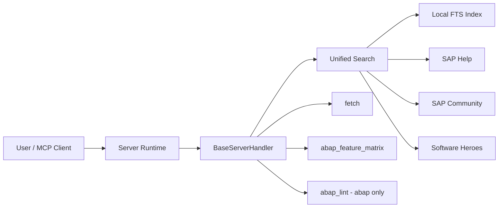
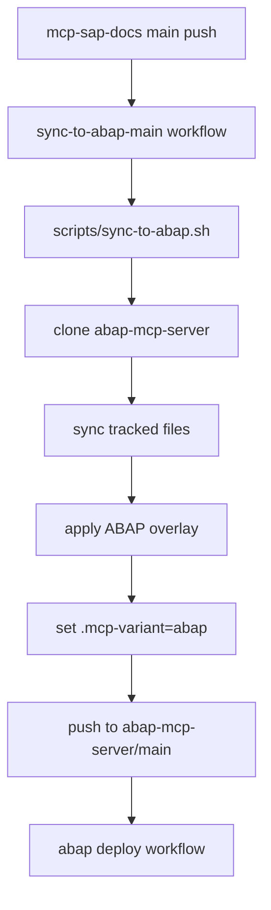

# Architecture

## Overview

`mcp-sap-docs` is now a single upstream codebase with configuration-driven variant behavior.

- Upstream: `mcp-sap-docs`
- Downstream sync target: `abap-mcp-server`
- Variant switch:
  - env `MCP_VARIANT`
  - fallback `.mcp-variant`
  - default `sap-docs`

## High-Level Flow

## Variant Layer

Variant configuration lives in:

- `config/variants/sap-docs.json`
- `config/variants/abap.json`

Variant controls:

- source allowlist
- allowed submodule paths
- enabled tools
- server identity (name/description)
- default ports
- PM2 process names
- deploy path hints
- metadata path

## Search Architecture

`src/lib/search.ts` implements the shared search surface.

Inputs:

- `query`
- `k`
- `includeOnline`
- `includeSamples`
- `abapFlavor`
- `sources`

Pipeline:

1. Local FTS candidate search
2. Metadata boosts + context scoring
3. Optional online retrieval (Help / Community / Software Heroes)
4. Reciprocal Rank Fusion (RRF)
5. URL and source dedupe

Behavior notes:

- `abapFlavor` primarily filters official ABAP docs libraries
- non-ABAP libraries remain available (for `sap-docs` profile)
- `includeSamples=false` suppresses sample-heavy sources

## Software Heroes Integration

### Content Search

`src/lib/softwareHeroes/contentSearch.ts` uses `START_SEARCH_JSON` to get structured
JSON results directly. This avoids HTML parsing entirely — only entity decoding is
needed on the `HEAD` and `TEXT` fields. The legacy `START_SEARCH` HTML parser is
retained for backward compatibility but is no longer the primary path.

### ABAP Feature Matrix

`src/lib/softwareHeroes/abapFeatureMatrix.ts` fetches the full English matrix via
`CUST_API` and caches it locally.

Caching strategy (three tiers):

1. **In-memory** (`TtlCache`, 24 h TTL) — fastest path.
2. **Live API** — tried on cache miss; on success the result is also persisted to disk.
3. **Disk fallback** (`dist/data/abap-feature-matrix.json`) — loaded when the API is
   unreachable. Has no TTL; serves as a last-resort offline source.

At server startup, `prefetchFeatureMatrix()` is called fire-and-forget to pre-warm
both caches so the first tool call is instant. If the API is down, the disk cache is
loaded instead. The server always starts regardless of fetch outcome.

## Tool Surface

`src/lib/BaseServerHandler.ts` registers tools.

Shared:

- `search`
- `fetch`
- `abap_feature_matrix`

Variant-gated:

- `abap_lint` enabled only when `abap` profile allows it

## Build and Setup

Build scripts remain shared but variant-aware:

- `setup.sh`: only initialize variant submodules
- `scripts/build-index.ts`: include only variant libraries
- `scripts/build-fts.ts`: index only variant libraries

## Runtime Modes

- `src/server.ts` (stdio)
- `src/http-server.ts` (status/dev HTTP)
- `src/streamable-http-server.ts` (streamable MCP HTTP)

Each runtime reads server identity and default ports from variant config.

## One-Way Sync Architecture

Key points:

- one-way only (upstream to downstream)
- downstream deployment remains push-driven in ABAP repo
- skip marker: `[skip-sync]`

## Docker and PM2

- `Dockerfile` supports variant build arg and runtime env
- `ecosystem.config.cjs` resolves process names/ports/path from variant config

## Source of Truth

All functional changes should be implemented in `mcp-sap-docs` first.
`abap-mcp-server` is synchronized output + ABAP-specific identity/deployment context.
